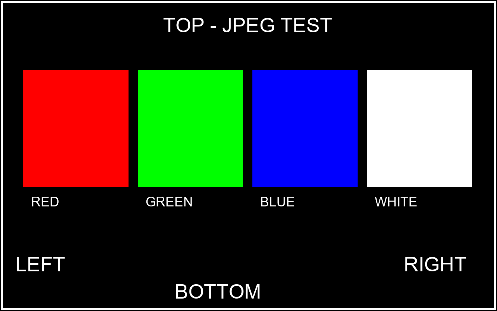

# ESP32-P4 本地视频播放器：从 MIPI 时序排错到一条命令换片

用 Waveshare ESP32-P4-WIFI6 和 WX101BH020I-40Z / JD9365D 屏幕，循环播放本地视频。用户把 MP4 放进 `mp4/`，选择片段时长，连接下载数据线，运行：

```powershell
.\play.cmd "video.mp4" 5
```

工具自动完成截取、转码、容量检查、编译和烧录。上电自动循环播放，无声；更新完成后只需供电即可独立运行。

本项目重点记录两个可复用成果：**MIPI 彩条正常但帧缓冲绿屏的时序定位过程**，以及 **MP4 → 转码 → 验证 → 编译 → 烧录的 Windows 命令行封装**。

## 适用硬件与验证状态

| 项目 | 本项目配置 |
|---|---|
| 开发板 | Waveshare ESP32-P4-WIFI6，ESP32-P4NRW32；实测芯片 rev 3.2 |
| 存储 | 32 MiB Flash、32 MiB PSRAM |
| 屏幕 | WX101BH020I-40Z，JD9365D，原生 800×1280，横放观看为 1280×800 |
| 接口 | 22 针 MIPI-DSI，2 条数据通道，960 Mbps/lane |
| 环境 | Windows PowerShell 5.1、ESP-IDF 5.5.5，目标 esp32p4 |
| 视频预设 | 30 fps、1280×720 视频区域，等比例适配、补黑边、无声；MJPEG q=12 |
| Flash 布局 | 2 MiB 播放器程序 + 29 MiB 独立视频分区 |

五色图、JPEG 颜色与方向、原有视频循环播放已由作者实机确认；优化后 12 fps 连续多轮实测为 11.98～11.99 fps。24/30 fps 已报告观感流畅，但没有完整统计证明持续达到目标帧率。

**当前分区分离版已经编译、容量及烧录清单检查通过，尚未完成实机验证。** 20 秒、600 帧素材为 26.01 MiB，应用为 277.5 KiB。[验证记录](docs/evidence/video_partition_validation.json)区分电脑检查与设备实测，不能将编译通过等同于播放通过。只验证过表中的板卡和屏幕组合。

## 关键排错：为什么彩条正常，视频却绿屏？

最初屏幕能显示 DSI 硬件彩条，切到 CPU 帧缓冲后却出现大面积绿色和底部杂色，并打印：

```text
No LCD frame completion; stop before reusing a buffer
events: frame=0->0 vsync=14->73 waits_completed=0/2
```

这条错误来自本项目的帧完成等待保护：提交后 1000 ms 内未等到新的 DMA 整帧完成通知，程序停止复用缓冲。它提示显示链路尚未完成一帧；错误文字本身不能直接判定是线缆、颜色格式还是 DMA 故障。硬件彩条也不能证明 PSRAM 帧缓冲扫描正常。

排查先比较硬件彩条与 CPU 五色图，再统一 RGB888、检查帧完成及 VSYNC 计数、读取 DMA 状态。跳过彩条切换、统一像素格式及按原方向重插排线后均未恢复。最终对照本机 IDF 5.5.5 的分频与行时序补偿实现，发现默认面板宏请求 **68 MHz**，而默认 DPI 时钟源为 **PLL240**：

```text
分频 = round(240 / 68) = 4
实际 DPI 时钟 = 240 / 4 = 60 MHz
原行总长 = 800 + 20 + 20 + 40 = 880
补偿后行总长 = round(60 / 68 × 880) = 776
补偿后行前沿 = 776 - 800 - 20 - 20 = -64
```

补偿后的行总长甚至小于有效显示宽度，形成无效时序。修复是在创建 DPI 面板前覆盖时钟请求，使请求频率与可实现频率一致：

```c
esp_lcd_dpi_panel_config_t dpi =
    JD9365_800_1280_PANEL_60HZ_DPI_CONFIG(LCD_COLOR_PIXEL_FORMAT_RGB888);
dpi.dpi_clock_freq_mhz = 60;
```

| 参数 | 修复前推算 | 修复后配置 |
|---|---|---|
| 请求 / 实际 DPI 频率 | 68 / 60 MHz | 60 / 60 MHz |
| 行总长 HTOTAL | 776 | 880 |
| 行前沿 HFP | -64，无效 | 40 |
| 场总长 VTOTAL | 1324 | 1324 |

修复后作者确认 CPU 红、绿、蓝、白、黑五色图正确，随后完成 JPEG 和视频验收。屏幕扫描频率按有效配置计算约 **51.5 Hz**；它与素材 30 fps 是两个参数。早期失败版本未记录实际行时序读回值，修复前数值属于源码与配置推算；修复后画面改善有实测支持。[完整调查过程](docs/DEBUGGING.md)和[计算记录](docs/evidence/dpi_timing_check.json)保留这一边界。

后续单独解决 JPEG 红蓝互换：使用 BGR 字节顺序。性能优化让硬件 JPEG 直接写入空闲 LCD framebuffer，减少每帧 3,072,000 字节的 CPU 复制；保留提交后的帧完成等待。基线 7.36 fps 改善为实际约 12 fps，而后进行了 24/30 fps 素材测试。

下面是用于检查颜色、方向及边框的参考图，供实机显示对照：



## 命令行封装怎样工作

```text
用户 MP4 + 时长
  → FFmpeg 截取、30 fps、缩放补边、旋转、MJPEG AVI
  → AVI 结构、帧数、尺寸、全部 JPEG 解码与 29 MiB 容量检查
  → 生成 clip_info.h、预览图和验证报告
  → ESP-IDF 编译并检查 2 MiB 应用与 29 MiB 视频分区
  → 完整烧录分区表、程序和独立视频
  → 复位并循环播放
```

原 MP4 的大小不决定能否装下，判断的是**所选片段转为 MJPEG 后的体积**。视频过大时提示“视频文件过大”，用户缩短时长后重试；工具不自动降帧率、降低画质或截短片段。输入及转码校验失败保留上一份电脑素材，编译失败不会烧录。

AVI 单独保存，是因为原来将视频嵌入应用时碰到了 esptool 的单段 16 MiB 限制。播放器通过 `esp_partition_mmap()` 访问视频，不把整个视频复制到 PSRAM。现在换片仍需重新生成元数据并编译小应用；同一条命令负责全部步骤。

## 第一次使用

1. 准备表中硬件，并安装 ESP-IDF **5.5.5 的 ESP32-P4 工具链**、Python 及 FFmpeg/ffprobe。本仓库不会升级或安装系统工具；其他 IDF 版本需要自行验证。
2. 克隆或下载本仓库，进入仓库根目录。复制配置示例并填写本机路径：

   ```powershell
   Copy-Item .\local-config.example.ps1 .\local-config.ps1
   notepad .\local-config.ps1
   ```

   `IdfEnvironmentScript` 填写安装器提供的 ESP-IDF 初始化脚本；`VideoPython` 是含 Pillow 的 Python，FFmpeg 与 ffprobe 填写各自 exe 路径。转码 Python 需要 Pillow；在自己的 Python 环境中执行一次：

   ```powershell
   & "你的Python路径\python.exe" -m pip install -r .\requirements.txt
   ```

   `local-config.ps1` 只用于本机，不上传 Git。仓库不依赖作者的用户名、磁盘目录或 Codex 运行环境。
3. 把自己的 MP4 放到 `mp4/`。默认从开头截取，秒数为正整数，且不超过源视频长度。
4. 连接开发板 CH343 下载/串口接口，确认端口，先退出串口监视器（Ctrl + ]）。运行：

   ```powershell
   .\play.cmd "video.mp4" 5 COM7
   ```

5. 等待转码、编译、烧录全部完成，以屏幕实际循环播放为最终成功标准。首次必须完整烧录新分区表、程序和视频，不用 app-flash 代替。长视频写入时间更长。

| 用途 | 命令 |
|---|---|
| 默认 COM7、前 5 秒 | `.\play.cmd "video.mp4" 5` |
| 中文带空格文件名 | `.\play.cmd "我的 视频.mp4" 5` |
| 指定 COM8 | `.\play.cmd "video.mp4" 5 COM8` |
| 只转码、检查和编译 | `.\play.cmd "video.mp4" 5 -BuildOnly` |

`play.cmd` 为这一轮子进程设置 ExecutionPolicy Bypass，解决 PowerShell 禁止执行脚本的问题，不永久修改系统策略。每次只保存一个片段，成功烧录后替换板上原视频。更详细的操作、报错与日志位置见[小白使用说明](docs/USAGE.md)。

## 目录与测试

```text
play.cmd / play-video.ps1       用户入口与转码、构建、烧录流程
local-config.example.ps1        本机工具路径模板
requirements.txt               转码 Python 依赖
mp4/                           用户输入，视频不纳入 Git
project/flash_video_mvp/
  main/main.c                  显示初始化、诊断、JPEG 与循环播放
  main/diagnostic.jpg          颜色与方向诊断图
  components/                  带来源记录的本地组件
  tools/prepare_video.py       转码、容量与逐帧验证
  tools/test_prepare_video.py  使用生成测试图的集成测试
  tools/idf.ps1                初始化官方 IDF 环境并调用 idf.py
  partitions.csv              2 MiB 程序 / 29 MiB 视频布局
  sdkconfig.defaults          已验证的目标与硬件配置
docs/                          排错、使用说明及验证记录
```

本仓库不分发用户视频、Flash 备份、构建缓存或数据手册。`clip.avi` 和 `clip_info.h` 由换片命令生成，首次不要直接跳过转码执行构建。生成的日志和预览在工程的 `logs/`、`preview/`，均不纳入 Git。

转码测试不接触硬件；先在 PowerShell 中加载本机配置，再调用配置中的转码 Python：

```powershell
powershell -NoProfile -ExecutionPolicy Bypass -Command '. .\local-config.ps1; & $VideoPython .\project\flash_video_mvp\tools\test_prepare_video.py'
```

也可在执行策略允许运行本地脚本的终端中直接运行 `. .\local-config.ps1`，再 `& $VideoPython .\project\flash_video_mvp\tools\test_prepare_video.py`。测试生成 20 秒素材，覆盖超限保留旧素材、长片段、源时长不足、零时长、缺失文件、中文与空格文件名。

## 来源与许可证

AVI 播放器来自 Espressif `esp-iot-solution` 的固定提交，JD9365 驱动保留 Espressif 的 Apache-2.0 文件声明。来源及本地改动见 [THIRD_PARTY.md](THIRD_PARTY.md)。根目录 LICENSE 将按作者选择加入，第三方原许可证与声明必须保留。

参考实现：[ESP-IDF 5.5 HAL 时序代码](https://github.com/espressif/esp-idf/blob/v5.5.5/components/hal/mipi_dsi_hal.c)、[官方分区 mmap 示例](https://github.com/espressif/esp-idf/tree/v5.5.5/examples/storage/partition_api/partition_mmap)、[Espressif JPEG 文档](https://docs.espressif.com/projects/esp-idf/en/latest/esp32p4/api-reference/peripherals/jpeg.html)。
